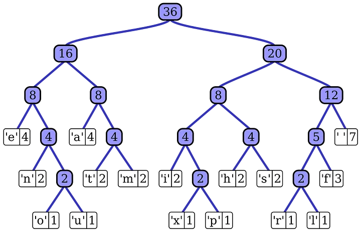
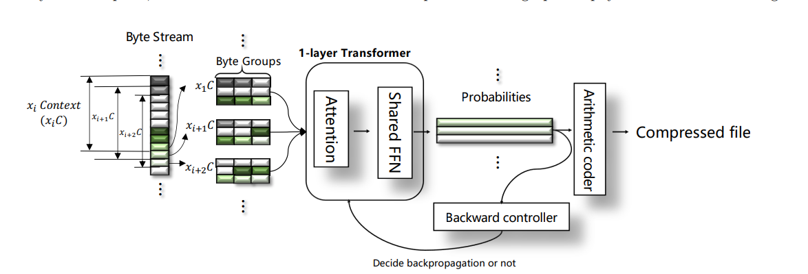
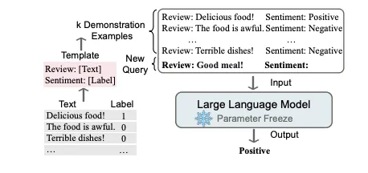
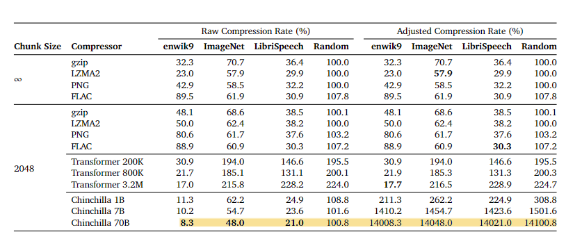
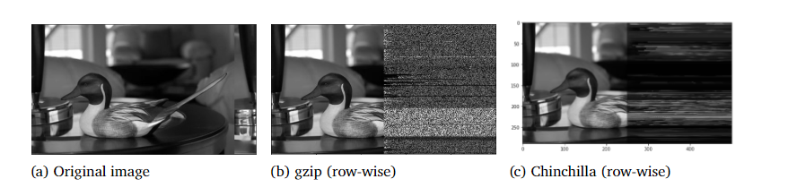

## Intro: Why I'm Hooked on Compression
So, I've been nerding out about data compression for a while now. Ever thought about why a high-quality movie doesn't eat up your entire hard drive? Take an uncompressed 1080p video that needs around 1.5 GB for just a minute. A two-hour movie would take up a whopping 300GB! But compress it with H.264, and you're down to around 150 MB per minute. Mind-blowing, right?

Recently, I stumbled upon a Google DeepMind paper that talks about using Transformers (yes, the machine learning models, not the robots) for compression. It got me super excited, and I decided to write this blog to share what I learned!

## What's the Deal with Data Compression?
Before we dive deep, let's break down what data compression and encoding actually mean.

The word “compression” comes from the Latin word compressare, which means to press together. “Encoding” is the process of placing a sequence of characters in a specialized format that allows efficient data storage as well as transmission. Per Wikipedia: “Data compression involves encoding information using fewer bits than the original representation.”

Compression algorithms work by identifying and removing redundant or unnecessary information from the file, without affecting the integrity or quality of the data. Different compression algorithms use different techniques to achieve this, such as replacing repeated data with references, eliminating unused data, or encoding the data in a more efficient format.

### Lossless vs. Lossy: What's the Difference?
There are two players in the compression game: lossless and lossy algorithms.
The former retains every bit of data, while the latter omits some details to achieve higher compression ratios. For instance, lossy algorithms often find use in video compression, where our brain's capacity to fill in gaps and focus on motion over details makes the losses unnoticeable

On the otherhand, lossless compression is required in any field where it is important to preserve the integrity of the data. for example, Text compression is a significant area for lossless compression. It is very important that the reconstruction is identical to the text original, as very small differences can result in statements with very different meanings. Consider the sentences "Do not send money" and "Do now send money." A similar argument holds for computer files and for certain types of data such as bank records.[standford: https://cs.stanford.edu/people/eroberts/courses/soco/projects/data-compression/lossless/index.htm]

### Huffman Coding
A foundational algorithm in this realm is Huffman Coding, a lossless compression technique. It minimizes the average code length by assigning shorter codes to more frequent data characters.

### Arithmetic Coding
Arithmetic coding is an advanced entropy coding technique used for lossless data compression. Unlike simpler methods like Huffman coding, arithmetic coding represents a sequence of symbols as a single floating-point number between 0 and 1.
It starts with a full range of [0, 1) and narrows this range as it goes through each symbol in the sequence, based on that symbol's probability. The final narrow range represents the compressed form of the entire sequence. Any number within this final range can be used to decode back to the original sequence.

### Exploring the Intersection of Transformers and Data Compression

Having acquainted ourselves with the fundamentals of data compression, let's now focus on arithmetic coding on top of a transformer architecture.

#### Dynamic Probabilities: A Game-Changer

Traditionally, arithmetic coding relies on pre-determined, static probabilities assigned to each potential symbol. But what if we could enhance this system by dynamically adjusting the probabilities based on the sequence of symbols observed thus far?

This is where predictive models come into play. These advanced algorithms adaptively calculate the likelihood of the next symbol in a sequence, taking into account its historical context. By replacing static intervals with these dynamically computed ranges, arithmetic coding becomes far more efficient.

#### The Power of Contextual Prediction

Consider a scenario where a predictive model calculates a high likelihood for the symbol "A" following a specific sequence of preceding symbols. In this case, a larger interval will be assigned to "A," leading to more efficient encoding. This model continually refines its predictions, updating itself after each symbol is encoded.

#### Why Transformers?

Transformer models stand out for their exceptional prowess in understanding sequence data. They have the ability to dynamically predict the likelihood of upcoming symbols based on the entire history of the sequence in question. Within the realm of data compression, this makes them an excellent candidate for serving as the predictive model that adapts and refines probability estimates for each subsequent symbol.

By integrating transformers into the arithmetic coding process, we tap into a well of potential for dramatically improving data compression methods. Stay tuned as we delve deeper into specific use-cases and performance benchmarks in upcoming sections.

#### What's the Current State of the Art?

If you've been tracking the evolution of transformers in the realm of data compression, you'll find a plethora of research and implementations. A standout among them is an approach discussed in [A Fast Transformer-based General-Purpose Lossless Compressor](https://arxiv.org/ftp/arxiv/papers/2203/2203.16114.pdf). This paper elegantly shows how combining transformer architectures with arithmetic coders can lead to highly efficient file compression.

#### A Paradigm Shift: Language Modeling as Compression

However, the paper [Language Modeling Is Compression](https://arxiv.org/abs/2309.10668) introduces a fresh perspective. Traditional methods have typically relied on training predictive models on external datasets, a time-consuming and costly affair. This paper proposes an alternative—leveraging in-context learning capabilities of Large Language Models (LLMs).

If you're new to the concept of in-context learning, it essentially means that LLMs can adapt and learn from a limited set of examples provided in the current context. For a deep dive, check out [this Medium article on understanding in-context learning](https://medium.com/@mlblogging.k/understanding-in-context-learning-in-large-language-models-like-gpt3-gpt-j-gptneox-e0a71063a6db).

#### Impressive Benchmarks with Chinchilla 70B

What caught my attention is the use of Chinchilla 70B, an LLM trained by Google. It's fascinating to see a model primarily trained on textual data being successfully applied to compress other types of data. Specifically, Chinchilla 70B was shown to compress ImageNet patches to 43.4% and LibriSpeech samples to 16.4% of their raw sizes. These figures outperform domain-specific compressors like PNG (58.5%) and FLAC (30.3%).

quite amazing isn't it?

#### Have All Problems Been Solved? Not Quite Yet.
The transformative power of Transformers in compression is undeniably promising, but one significant obstacle remains: **Context Length**. Ideally, the model would utilize a comprehensive context to produce an impeccably accurate prediction for the next data segment. However, practical limitations dictate otherwise.

Context length essentially caps the amount of data that the model can consider for its predictions. A more extensive context would undoubtedly lead to more accurate and efficient compression. The paper elegantly sums this up by stating, "Having a longer context allows a compressor to exploit more sequential dependencies to achieve a better compression rate."

In summary, while substantial advancements have been made, there remains a scope for further optimization and refinement in the application of Transformers to data compression.
